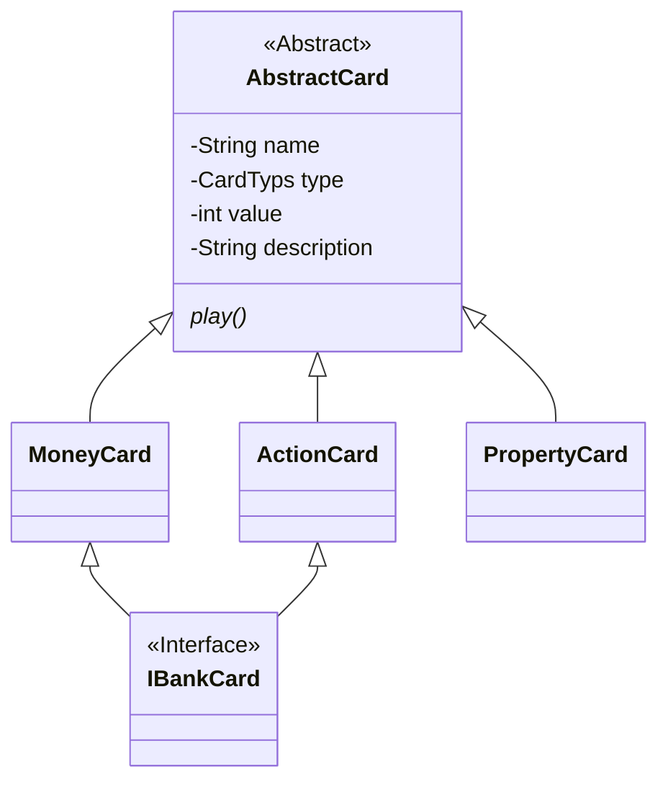

# Monopoly Deal

## Configure Commit Lint Hook

```shell
$ chmod ug+x .githooks/*
$ git config core.hooksPath .githooks
```

[🌈Conventional Commits😋](https://www.conventionalcommits.org/en/v1.0.0/)

## Class Diagram


