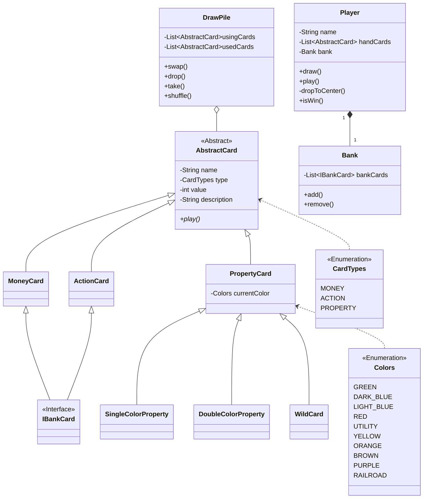

# Monopoly Deal

<p align="center">
  
</p>

## Configure Commit Lint Hook

```shell
$ chmod ug+x .githooks/*
$ git config core.hooksPath .githooks
```

[🌈Conventional Commits😋](https://www.conventionalcommits.org/en/v1.0.0/)

## Class Diagram


