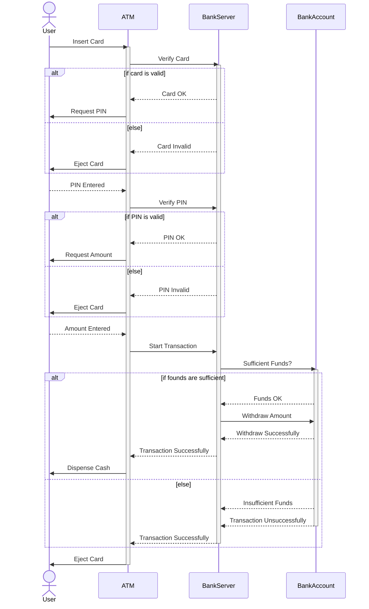
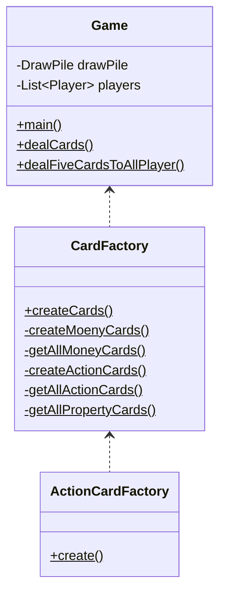
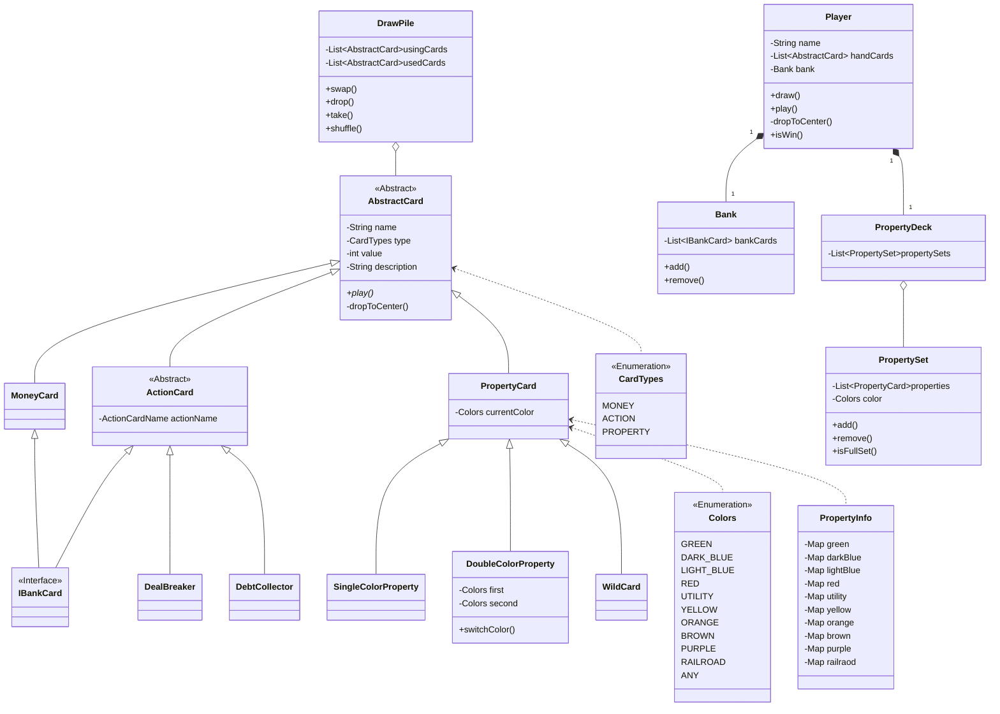
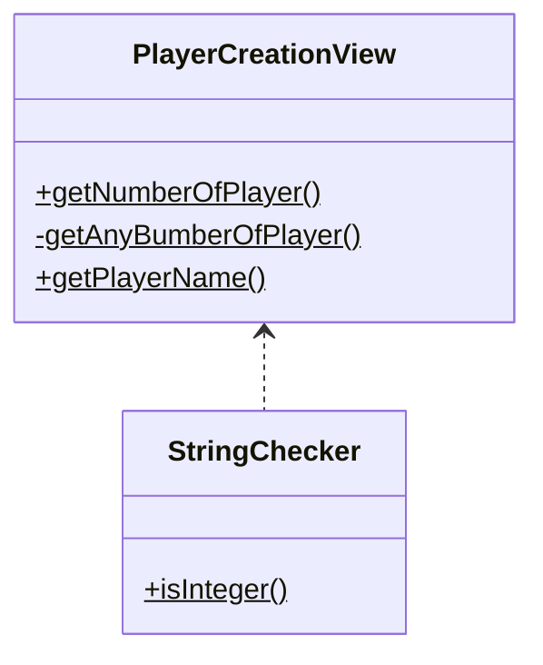

# Monopoly Deal

<p align="center">
  
</p>

## Configure Commit Lint Hook

```shell
$ chmod ug+x .githooks/*
$ git config core.hooksPath .githooks
```

[🌈Conventional Commits😋](https://www.conventionalcommits.org/en/v1.0.0/)

## Sequence Diagram (Example)



## Controller




## Class Diagram



## View



## Game Rules

### Useful Links and Resources

[Project Specification (Google Docx)](https://docs.google.com/document/d/1TjmL5h7cKIPK9J1YODy5UXHr-V7amlcUvKbrnP23Drc/edit?usp=sharing)

[Comprehensive Monopoly Deal Rules](https://monopolydealrules.com/)

### How to Win

- Be the **FIRST PLAYER** to collect **3 FULL PROPERTY SETS** of **DIFFERENT COLORS**.

### Set Up

1. **SHUFFLE** the cards together and deal **5** to each player, **FACE DOWN**.
2. Look at your cards, but keep them a **SECRET**.
3. Put the remaining cards face down in the center to create the **DRAW PILE**.
4. Decide **WHO GO FIRST**. Play continues **CLOCKWISE**.

### On Your Turn

1. **TAKE 5 CARDS**

1. 1. Later in the game, **if you HAVE NO CARDS, pick up 5 instead.**

1. **PLAY UP TO THREE CARDS**

1. 1. You don't have to play any cards if you **DON'T WHAT TO**.
   2. ***PUT MONEY or ACTION CARDS INTO YOUR OWN BANK***

1. 1. 1. Player can **CHARGE EACH OTHER** for rent, birthday etc.
      2. If you put an Action card into your bank, it **BECOMES REDUNDANT** as an Action card.
      3. If you use it (action card in yuour bank) to pay another player, it must **GO INTO THEIR BANK**.

1. 1. ***PUT DOWN PROPERTIES INTO YOUR OWN COLLECTION***

1. 1. 1. Each card shows **HOW MANY PROPERTIES** there are to collect in that color set.
      2. You can **ONLY REORGANIZE** your propety collections **IN YOUR TURN**.

1. 1. ***PLAY ACTION CARDS INTO THE CENTER***

1. 1. 1. Action cards can be put into your bank **AS MONEY**.

1. **IMPORTANT: HOW TO PAY OTHER PLAYERS**

1. 1. Cards can **NEVER GO BACK** into a players's hand.
   2. **NEVER PAY** with cards **FROM YOUR HAND**, only from the cards in front of you.
   3. You can pay with cards from you **BANK, PROPERTIES** or a **COMBINATION** of booth. It's **YOUR CHOICE**.
   4. **CHANGE** is **NOT GIVEN**.
   5. If you **PAY WITH PROPERTY** cards, they **MUST GO INTO** the other player's **PROPERTY COLLECTION**.
   6. If you have **NO CARDS TO PAY**, you **DON'T PAY** at all.

1. **END YOUR TURN**

1. 1. If you have **MORE THAN 7 CARDS IN YOUR HAND** at the end of your turn, **DISCARD** extras to **THE BOTTOM OF THE DRAW PILE**, so you **ONLY HAVE 7**.
   2. If you've **RUN OUT OF CARD,** **TAKE 5** at the **START** of your **NEXT TURN**.
